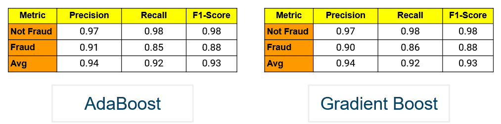

# IndonesiaAI-Portfolio-Project-2
📁 Created by: Mohammad Arief Rajendra, in April 2024

## Project 2: Fraud Detection

The Fraud Detection Project is part of Indonesia AI's Bootcamp Portfolio Project, which tasks students with developing machine learning algorithms to predict fraudulent credit card transactions, spanning across 1000 customers with a pool of 800 merchants. I did not include the dataset due to its size, but you can find it here: https://www.kaggle.com/datasets/kartik2112/fraud-detection/data

To predict the fraudulent transactions, we utilized several models, including AdaBoost, Gradient Boost, XGBoost, and K-Nearest Neighbors. I contributed to this team's project by creatiung the AdaBoost and Gradient Boost models.

## Getting Started

You can easily implement the code in this repository by:

1. Cloning this project
2. Set up Python and Jupyter Notebook locally, either directly from Python or using Anaconda, or you can use Google Colab if you wish to have faster processing without a local GPU
3. Make sure that you have installed the required packages that are included at the start of the Jupyter Notebook .ipynb file
4. Run the code as is, or add your modifications

## The Result

The result is a rather equivalent performance between the two models, with an F1-Score of 0.93. However, the Gradient Boost model did perform slightly better, with a recall score of 0.86 as compared to the 0.85 recall rate of the AdaBoost model

